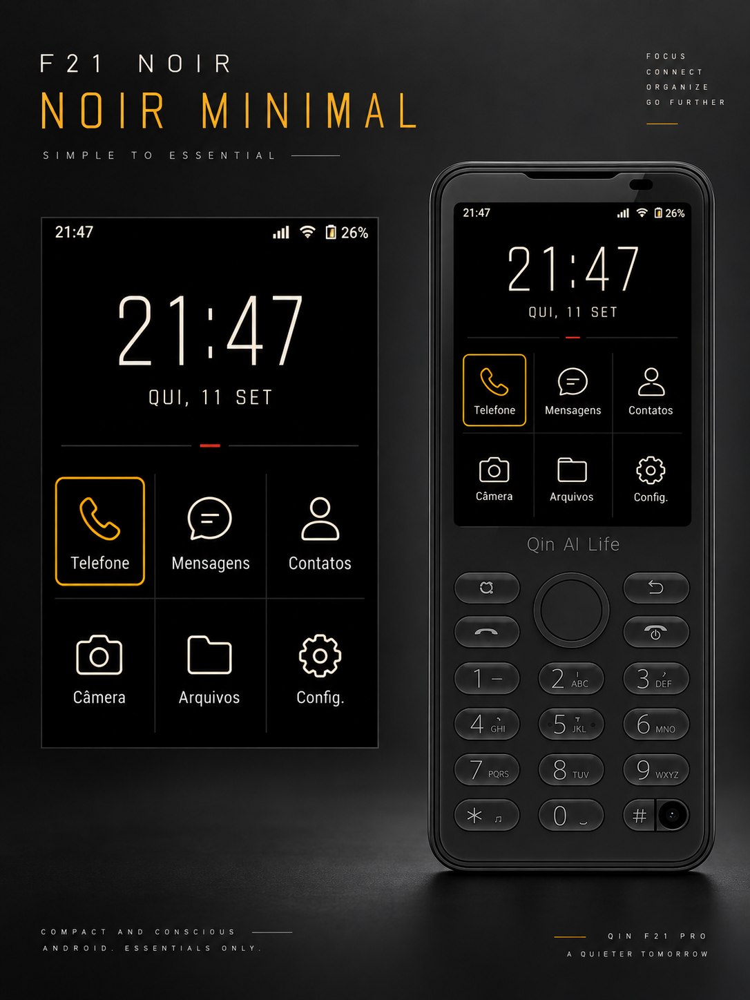
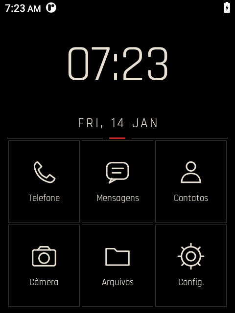
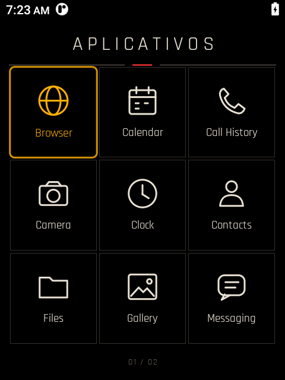
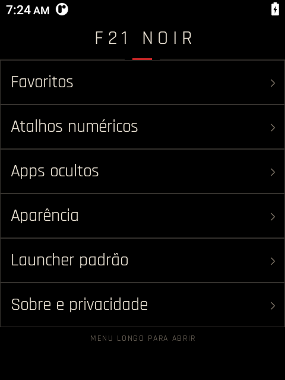

# F21 Noir

F21 Noir is a small, offline Android launcher designed for the Qin/DuoQin F21 Pro running
Android 11. It keeps the stock Launcher3 installed, uses the physical keypad throughout, and
contains no ads, telemetry, Google services, or network permission.

> **Alpha:** the interface and automated physical-device flows were tested on an F21 Pro. Manual
> long-press key confirmation and the 72-hour stability test are still required before beta.



### Running on the physical F21 Pro

| Home | App drawer | Settings |
|---|---|---|
|  |  |  |

## Features

- Noir Minimal interface for the F21's 480×640 display at 208 dpi.
- Large 24-hour clock and six editable favorites.
- Monochrome app icons and a 3×3 paginated app drawer.
- D-pad focus, center-to-open, Menu for apps, and long Menu for settings.
- Short number press opens the dialer; long press launches a configurable shortcut.
- Reversible hidden-app list and a direct route back to Android's default-home settings.
- No runtime permissions and no broad package-list permission; the manifest exposes only the
  launcher-intent queries needed to draw the app drawer.

## Build

Requirements: JDK 17 and Android SDK 35.

```console
./gradlew test assembleDebug lintDebug
```

Install only on the selected F21 serial:

```console
adb -s YOUR_F21_SERIAL install -r app/build/outputs/apk/debug/app-debug.apk
```

Choose **F21 Noir** when Android asks for the Home app. The stock Launcher3 is not removed.

## Safety and privacy

F21 Noir enumerates launchable activities so it can show the app drawer. Preferences stay in the
app's private local storage. It has no network stack, analytics SDK, updater, account, or background
service. See [PRIVACY.md](PRIVACY.md).

For device recovery, see [F21 Rescue](https://github.com/elmirok/f21-rescue).
Portuguese documentation: [docs/pt-BR/README.md](docs/pt-BR/README.md).

## License

Apache-2.0. Rajdhani is distributed under the SIL Open Font License in
`THIRD_PARTY_NOTICES/rajdhani-OFL.txt`.
